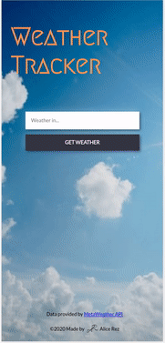
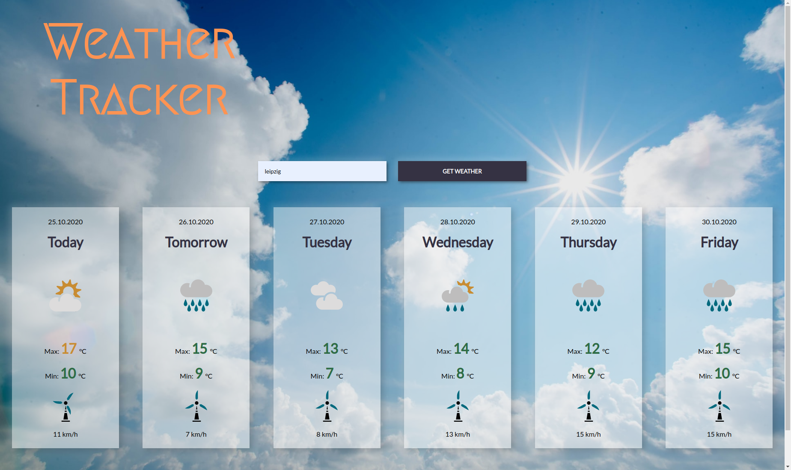

<h1> </h1>

## Description

[Live Demo](https://alice-rez.github.io/Weather-Tracker/)

Project from second half of the javascript in browser environment module of my web development course (before learning React) - application that get from API basic weather data for selected location, manipulate them and display them to the user. Data are displayed with purpose to enable user quick orientation:

- image describing weather status
- 4 colors for quick distinguishing basic level of the temperature:
  1. blue for frost (< 0°C)
  2. green for low-moderate temperature (0 - 15°C)
  3. orange for warm temperature (16 - 29°C)
  4. red for heat (30°C and above)
- icon for wind with 5 colors for quick distinguishing of the wind strength (according to Beaufort scale levels for warning flags):
  1. blue for calm till fresh breeze (< 39 km/h)
  2. green for strong breeze till near galle (39 - 61 km/h)
  3. orange for gale (62 - 88 km/h)
  4. red for storm (89 - 117 km/h)
  5. purple for Hurricane (118 km/h and above)

The wind icon is also animated to rotate faster with stronger wind. Animation is infinite in the case of the mobile version, for tablets and desktop is animation just on hover over relevant card (so user will be not distracted by multiple animations going in the same time).

## Implementation

Application uses [MetaWeather API](https://www.metaweather.com/api/) as a source of the weather data and also as a source for weather status images (for now, in future own SVG icons are planned).

**Used technologies**: Vanilla JS, DOM, asynchronous Javascript (fetch, async await), API, jquery, handlebars, SVG + animation (animation of the wind icon), HTML, CSS, SASS (SCSS - variables, mixins)

**Basic function:**

- two stage API call - at first for location and then with received woid code for the weather info itself
- if the location does not exist, the error message is displayed
- otherwise, the data are basically manipulated (the manipulation is done in initial result object, so the values of the properties are overwritten):
  1. date is transformed from YYYY-MM-DD to DD.MM.YYYY
  2. day label is added (today/tomorrow/name of day)
  3. values of temperatures are rounded
  4. wind speed is recalculated from mph to km/h and the resulted values is rounded
  5. address to the relevant weather status image is added using weather state abbreviation obtained from API
- results of manipulation are injected to the html using handlebars
- the injected data are then styled according to the temperature value/wind strength

## Gallery

**Fig.1:** Desktop look of the application

